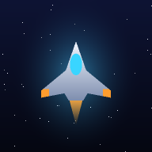

# 🚀 Starfighter

**Ein moderner Arcade-Shooter für das Handy** – eine Neuauflage im Geist der
klassischen Vertikal-Scroller der 80er (Xevious lässt grüßen), gebaut als
installierbare Web-App (PWA). Läuft in jedem modernen Browser, offline, ohne
Installation aus einem App-Store.



## Sofort spielen

Das Spiel ist eine statische Web-App – einfach hosten und loslegen:

```bash
# lokal testen:
python3 -m http.server 8000
# dann http://localhost:8000 öffnen
```

Für das echte Handy-Erlebnis die Seite über **GitHub Pages** (oder einen
beliebigen Webserver mit HTTPS) bereitstellen, auf dem Handy öffnen und über
**„Zum Startbildschirm hinzufügen"** installieren – dann startet Starfighter
im Vollbild und funktioniert komplett offline.

> GitHub Pages aktivieren: *Settings → Pages → Deploy from branch* auswählen.

## Das Spiel

Du fliegst über eine endlos scrollende Welt aus Wiesen, Wäldern, Ozeanen,
Wüsten und feindlichen Tech-Basen. Wie beim großen Vorbild gibt es **zwei
Waffensysteme**:

- die **Bordkanone** gegen Luftziele (feuert automatisch) – wahlweise als
  **Fächerfeuer** oder **durchschlagender Laser** (Power-ups S/L wechseln
  das System, erneutes Einsammeln verstärkt es)
- **Bomben** gegen Bodenziele – ein Fadenkreuz fliegt vor dem Schiff her,
  Ziele darin werden automatisch bombardiert
- optional dazu: **Zielsuchraketen** (Power-up H)

**Zwei Spielmodi**, direkt auf dem Titel wählbar:

- **Missionen**: Alle 60–70 Sekunden wartet ein Boss – im Wechsel das
  **Mutterschiff** (erst die vier Türme, dann der freigelegte Kern) und
  die **Bodenfestung**, deren Kern sich nur periodisch öffnet und
  **ausschließlich mit Bomben** verwundbar ist
- **Endlos**: keine Bosse, dafür ohne Ende steigende Wellen – wie lange
  hältst du durch? (In der Bestenliste mit ∞ markiert)

**Gegner-Arsenal** (9 Luft- + 6 Bodentypen): Toroid-Ringdrohnen,
Kurvenflieger, Sturzflieger, Kanonenboote, Kreisel, Panzerkäfer (zerfallen
in Splitter), Minenleger mit Schwebeminen, Zielsuchraketen aus Bodensilos,
Flak-Batterien mit Sprenggranaten, Geschütztürme, Panzer, Radaranlagen …

### Steuerung (bewusst einfach)

| Aktion | Handy | Desktop |
|---|---|---|
| Bewegen | Finger irgendwo hinlegen und ziehen | Pfeiltasten / WASD |
| Schießen | automatisch | automatisch |
| Bombardieren | automatisch (Ziel im Fadenkreuz) | automatisch |
| Pause | ⏸-Knopf | P oder Esc |

### Punkte & Kette

Bodenziele ohne Fehlwurf hintereinander zerstören lässt den
**Ketten-Multiplikator bis ×8** steigen. Ein Bombentreffer ins Leere setzt
die Kette zurück. Extraleben gibt es ab 30.000 Punkten, danach alle 50.000.

### Power-ups

| Symbol | Wirkung |
|---|---|
| **S** | Fächerfeuer (bis zu 5 Schüsse) / Wechsel auf Vulcan |
| **L** | Laser: durchschlägt bis zu 3 Gegner / Wechsel auf Laser |
| **H** | Zielsuchraketen-Werfer (max. 2) |
| **R** | höhere Feuerrate |
| **E** | Schild komplett auffüllen |
| **D** | Begleit-Drohne (max. 2) |
| **B** | Mega-Bomben mit größerem Radius |
| **1UP** | Extraleben |

## Was gegenüber dem Original verbessert wurde

Die Klassiker von damals hatten bekannte Schwächen – hier wurden sie gezielt
angegangen, Ziel: **maximaler Spielspaß statt maximaler Frust**:

| Kritik damals | Lösung in Starfighter |
|---|---|
| Ein Treffer = sofort tot | **Schild mit 3 Zellen**, erst danach kostet es ein Leben |
| Träges Schiff | Direkte 1:1-Touch-Steuerung, Empfindlichkeit einstellbar |
| Keine Power-ups, kaum Progression | 6 Power-up-Typen, Drohnen, Waffenstufen |
| Bomben-Zielen fummelig | **Auto-Bombardierung** mit sichtbarem Ziel-Lock |
| Monotone Landschaft | 5 wechselnde Biome, Fluss, Straßen, Wolken-Parallax |
| Brutale Schwierigkeitssprünge | Sanft ansteigende Schwierigkeit, faire kleine Hitbox, kurze Unverwundbarkeit nach Treffern |
| Verlust von allem beim Tod | Beim Respawn bleibt fast alles erhalten (nur eine Fächerstufe geht verloren) |
| Repetitiver Sound | Eigener Soundtrack + Boss-Musik, komplett synthetisiert |

## Schwierigkeitsgrade

Direkt auf dem Titelbildschirm wählbar:

| | Schild | Leben | Gegnertempo | Punkte |
|---|---|---|---|---|
| **Leicht** | 4 Zellen | 4 | langsamer, ruhigere Wellen | ×0,7 |
| **Normal** | 3 Zellen | 3 | Standard | ×1,0 |
| **Schwer** | 2 Zellen | 3 | schneller, dichtere Wellen | ×1,4 |

Risiko lohnt sich: Auf „Schwer" gibt es 40 % mehr Punkte. In der Bestenliste
wird der Schwierigkeitsgrad mit angezeigt (L/N/S).

## Grafik: Modern ↔ Retro-Pixel

Alle Spielobjekte sind **handgesetzte Pixel-Art-Sprites** im Stil der
Arcade-Automaten der 80er/90er: Outlines, Schattierungen, Cockpit-Glanz,
Nieten, Panel-Linien, klassische 4-Frame-Explosionsanimationen — dazu ein
Arcade-HUD mit blinkendem „1UP" und „HI-SCORE".

Zusätzlich lässt sich der Look in den **Optionen** umschalten:

- **Modern**: Pixel-Sprites plus Glow, Schockwellen, Bodenschatten,
  weiche Wolken und Vignette (90er-Arcade mit Effekten)
- **Retro-Pixel**: die Welt wird intern in 240×400 gerendert und
  pixelig hochskaliert – mit Scanlines wie auf einem Arcade-Monitor

Sound- und Grafikstil sind unabhängig kombinierbar: modern spielen mit
8-Bit-Sound, oder Voll-Retro wie am Automaten.

## Sound: Modern ↔ 8-Bit

In den **Optionen** lässt sich der komplette Klang jederzeit umschalten:

- **Modern**: fette Sägezahn-Synths, Sub-Bass, Filter-Sweeps, Delay-Raum
- **8-Bit**: originalgetreuer Chiptune-Klang – Rechteck- und Dreieckwellen,
  LoFi-Rauschen wie aus dem Automaten

Beides wird zur Laufzeit per WebAudio synthetisiert – das Spiel enthält
**keine einzige Audiodatei** (und keine urheberrechtlich geschützten Klänge).

## Bestenliste

Nach jeder Runde, die es in die Top 10 schafft: **Namen eingeben** und
verewigen. Die Liste (Top 10 mit Name, Punkten und erreichter Stufe) wird
lokal auf dem Gerät gespeichert.

## Technik

- **Kein Framework, keine Assets, keine Abhängigkeiten** – pures
  HTML5-Canvas, Vanilla JS und WebAudio (~2.500 Zeilen)
- Prozedural generiertes Terrain, alle Sprites als Vektor-Rendering mit
  Glow-/Partikeleffekten, Screenshake, additivem Blending
- **PWA**: Manifest + Service Worker → offline spielbar, installierbar
- Läuft mit 60 FPS auch auf älteren Geräten (logische Auflösung 480×800,
  DPI-scharf skaliert)

```
index.html          Einstiegspunkt & UI-Screens (Deutsch)
style.css           UI-Design
js/audio.js         Sound-Engine (Modern/8-Bit, Musik-Sequencer, SFX)
js/terrain.js       prozedurales Scroll-Terrain mit Biomen
js/entities.js      Spieler, Gegner, Boss, Projektile, Power-ups, Partikel
js/game.js          Spielschleife, Wellen-Direktor, Kollisionen, HUD, Screens
sw.js               Service Worker (Offline-Cache)
manifest.webmanifest PWA-Manifest
tools/gen_icons.py  erzeugt die App-Icons (pures Python, keine Dependencies)
```

## Lizenz

MIT – siehe [LICENSE](LICENSE). Alle Grafiken und Sounds werden prozedural
erzeugt; das Spiel ist eine eigenständige Hommage an das Genre und verwendet
keinerlei Original-Assets.
